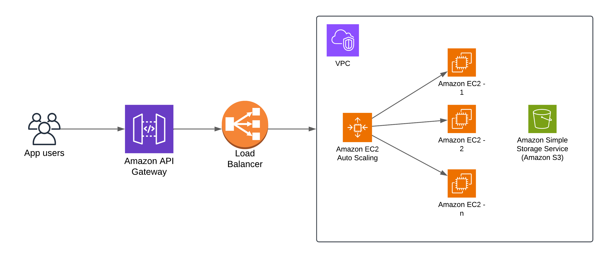

## Lab Overview:
This lab guides participants through the theoretical design of a secure and scalable web application architecture using AWS services. It will explore the integration of core AWS services, IAM configurations, and strategies for optimizing resource management and cost.

## Objectives:
By the end of this lab, participants will be able to:

Outline an AWS cloud architecture using core services like EC2, S3, and VPC.
Design IAM roles and policies that ensure security and compliance with the principle of least privilege.
Propose resource management strategies to optimize performance and cost.

## Instructions:
## Part 1: Designing Cloud Infrastructure
### - Task:
- Design a cloud infrastructure for a scalable web application.
- Include components like compute instances, storage, and network configurations.
- Use AWS EC2, S3, and VPC to build the basic architecture.

#### Elastic Compute Cloud (EC2):
- EC2 proporciona capacidad informática redimensionable en la nube. Permite a los usuarios ejecutar servidores virtuales y gestionar la configuración de red, incluido el direccionamiento IP, los grupos de seguridad y el almacenamiento de datos. Las instancias de EC2 se pueden personalizar con una variedad de configuraciones para adaptarse a diferentes requisitos de carga de trabajo, desde instancias de uso general hasta optimizadas para cómputo, optimizadas para memoria, etc.
#### Simple Storage Service (S3):
- S3 ofrece almacenamiento de objetos escalable adecuado para copias de seguridad, archivos y almacenamiento de datos en Internet. Está diseñado para facilitar la computación a escala web proporcionando una interfaz sencilla para almacenar y recuperar cualquier cantidad de datos desde cualquier lugar de la web. Con sólidas funciones de seguridad, S3 garantiza la disponibilidad, integridad y seguridad de los datos. También admite políticas de ciclo de vida para gestionar los datos a lo largo de su ciclo de vida, y varias clases de almacenamiento adaptadas a diferentes casos de uso para una mayor rentabilidad.
#### Virtual Private Cloud (VPC):
- VPC lets you provision a logically isolated section of the AWS Cloud where you can launch AWS resources in a virtual network that you define. This virtual network closely resembles a traditional network that you might operate in your own data center, with the benefits of using the scalable infrastructure of AWS. VPC provides advanced security features, including security groups and network access control lists, allowing you to build secure and scalable cloud architectures.

## Part 2: IAM Configuration

### - Task:
- Define IAM roles and policies for different components of the architecture, such as developers, admins, and application servers.
- Ensure that each role adheres to the principle of least privilege.

#### development rol:
- Este rol es indispensable para los programadores que trabajan en la aplicación. Permisos: Acceso a entornos de dev y qa, y permisos de lectura limitada en producción.

#### administration rol:
- Este rol tiene acceso completo para gestionar toda la infraestructura y responder a problemas críticos. Permisos de administrador

#### app user rol:
- La aplicación necesita permisos para interactuar con recursos como bases de datos, almacenamiento (S3) y servicios de notificaciones. Permisos: Acceso controlado a recursos específicos (S3, RDS/DynamoDB, SNS/SQS, etc.).

## Part 3: Resource Management Strategy
### Task:
- Develop a strategy for managing resources that includes auto-scaling, load balancing, and cost optimization using AWS Auto Scaling, ELB, and AWS Budgets.

#### Auto Scaling:
Se configura un grupo de escalado automático para las instancias EC2:

Mínimo: 2 instancias.
Máximo: 10 instancias.
Métrica de escalado: Uso de CPU (por ejemplo, escalar si el uso de CPU supera el 70%).
#### Load Balancing:
Se usara un Application Load Balancer para:

#### Distribuir tráfico entre las instancias EC2.
Comprobar el estado de las instancias para redirigir tráfico solo a las saludables.
#### Optimización de Costos:
Se usara AWS Budgets para monitorear gastos.
Configurar políticas de ciclo de vida en S3 para mover datos antiguos a clases de almacenamiento más baratas (como S3 Glacier).
## Part 4: Theoretical Implementation
Using the AWS services identified, outline the architecture for the web application. Describe how each component interacts with others, focusing on the flow of data and control between services. This description should detail the role of each service in the architecture, ensuring a clear understanding of their interactions and dependencies.

#### Flujo de interacción entre componentes:
1. La petición se recibe por medio del **API Gateway**, en este paso la autenticación y autorización se le delega a este componente
2. El **Load Balancer**, redirecciona la petición al recurso que se encuentre disponible
3. El **Load Balancer**, es el componente que tiene privilegios para comunicarse con la **VPC**, permitiendo tener el acceso seguro a las instancias de **EC2**
4. El incremento de carga sobre cada instancia de **EC2**, es administrado por el **Autoescalado de EC2**
5. Las aplicaciones que viven dentro de cada instancia de **EC2** tiene acceso a los recursos que se encuentran de la **VPC**.

## Part 5: Discussion and Evaluation
### - Discussion Points:
- Explain the choice of services and how they interact to provide a resilient and secure infrastructure.
- Discuss how the designed IAM policies contribute to overall security.
- Review the resource management strategy to ensure it meets the scalability and cost-efficiency needs.

This theoretical lab encourages a comprehensive approach to designing using AWS, leveraging the knowledge gained in the lessons to ensure a holistic understanding and practical approach to secure, scalable cloud architecture designs without the need for direct AWS access.

#### Elección de los servicios e interacción 
- **EC2:** Proporciona la capacidad de manejar un backend dinámico y escalable.
- **S3:** Ideal para almacenar y servir contenido estático de manera eficiente y económica.
- **VPC:** Proporciona seguridad y control sobre la red.
#### Políticas de seguridad IAM:
- Las políticas de IAM se configuraron para minimizar los permisos de cada rol, siguiendo el principio de menor privilegio.
- Disminuyendo el riesgo de acceso no autorizado a los recursos.
#### Estrategia de administración de Recursos:
- La combinación de Auto Scaling. Load Balancing y API Gateway asegura que se tengamos todos los elementos cubiertos para la interacción del usuario final.
- Los presupuestos y políticas, los podemos administrar dependiendo del uso para que el mantenimiento de la misma sea sustentable.