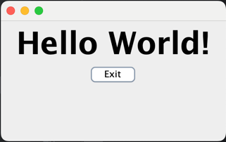

## Lab Overview
This lab session provides participants with an opportunity to apply multiple design patterns in a cohesive project simulation. By addressing a series of design challenges within a language-agnostic framework, participants will integrate patterns such as Singleton, Factory, Observer, and various asynchronous models to develop solutions that are robust, scalable, and efficient.


## Tasks
### 1. **Design Problem Solving:**

- **Scenario Description:** Participants are provided with a series of common software design challenges. They will need to choose appropriate design patterns to solve these specific problems effectively.

- Design Challenges:

    - **Global Configuration Management:** Design a system that ensures a single, globally accessible configuration object without access conflicts.
      - **Singleton:** El código está en en el paquete com.ironhack.singleton

    - **Dynamic Object Creation Based on User Input:** Implement a system to dynamically create various types of user interface elements based on user actions.
      - **Factory:** El código está en en el paquete com.ironhack.factory

    - **State Change Notification Across System Components:** Ensure components are notified about changes in the state of other parts without creating tight coupling.
      - **Observer:** El código está en en el paquete com.ironhack.observer 

    - **Efficient Management of Asynchronous Operations:** Manage multiple asynchronous operations like API calls which need to be coordinated without blocking the main application workflow.
      - **Future:** El código está en en el paquete com.ironhack.future

  - **Task:* Outline solutions that integrate these patterns into a cohesive design to address the challenges.

### 2. **Project Execution Simulation:**

- Simulate the application of these patterns in a hypothetical software project. Document the approach, rationale, and integration process of the chosen patterns as they apply to the design challenges.

- **Singleton:** Salida

```console
Si ves el mismo valor, es que se ha reutilizado el singleton
Si ves valores diferentes, es que se han creado 2 singletons

Resultado:

FOO
FOO
```

-  **Factory:** Salida

```console
<button>Test Button</button>
Click! Button says - 'Hello World!'
```



- **Future:** Salida

```console
Primera llamada a la API
Result 1: {'orderId': '123234'}
Segunda llamada a la API
Result 2: {'products': ['productId': '213123']}
Tercera llamada a la API
Resultado final: {'orderId': '123234', 'products': ['productId': '213123']}
```

## Deliverables:

- **Design Solution Outline:** A document that describes the selected design patterns for each problem.

- **Project Simulation Report:** A detailed report that narrates the simulation process, explains the rationale behind each design decision, and illustrates how the patterns were integrated into the project.