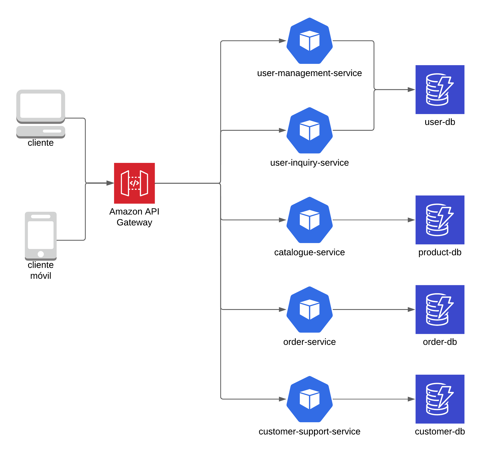

## Service Interaction and Communication Flow
- **User Management Service:** Provides authentication, authorization and user profile control. This service can interact with the API Gateway to manage sessions and authentication tokens.
- **Product Catalog Service:** Responsible for providing product details to other applications and the frontend, managing pricing and inventory. Communicates with the Order Processing Service when inventory updates are needed during the purchase process.
- **Order Processing Service:** Tracks the shopping cart and manages the entire ordering process. Interacts with the User Management Service to verify user preferences and the Product Catalog Service for product and inventory details. In addition, it communicates with the Customer Support Service when customer information is required in case of returns.
- **Customer Support Service:** Manages user requests for help or returns. It can access Order Processing Service order history and User Management Service user information to resolve queries.
- **API Gateway:** Controls all external requests and routes them to the appropriate service. Provides authentication, authorization and load balancing.

## Strategy for Handling Data Dependencies
As a priority Each microservice should have its own database:

- **Split the monolithic schema:** Extract tables and data related to each service into separate databases. For example, users and preferences will move to the User Management Service, while products and inventory will go to the Product Catalog Service.
- **Temporary data synchronization:** For the transition, use temporary shared databases or messaging services that allow real-time data updates between services while the migration is completed.

After the migration, it would be to divide the monolith by functionality. Start with the functionality that has less dependencies with others, in this case it would be the product catalog service.

## Monolithic Database Migration Process
- **Define Database Schemas by Service:** Create independent databases for each microservice according to their needs.
- **Data Migration:** Perform data migrations with ETL scripts to transfer data from the monolithic schema to the distributed databases.
- **Integration and Validation Testing:** Validate that each service can access its database and communicate with other services correctly.
## Reflection Report
- **Data Fragmentation:** By splitting the database, it is difficult to maintain real-time data consistency, especially in shared entities (such as user or orders).
- **Communication between Services:** Microservice interaction requires each service to handle response times well. Asynchronous messaging is critical, but complicates monitoring and failure handling.
- **Testing and Validation:** With independent services, testing all functionality together can be complex. We need rigorous integration testing and monitoring tools to avoid errors.

